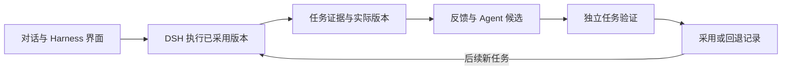
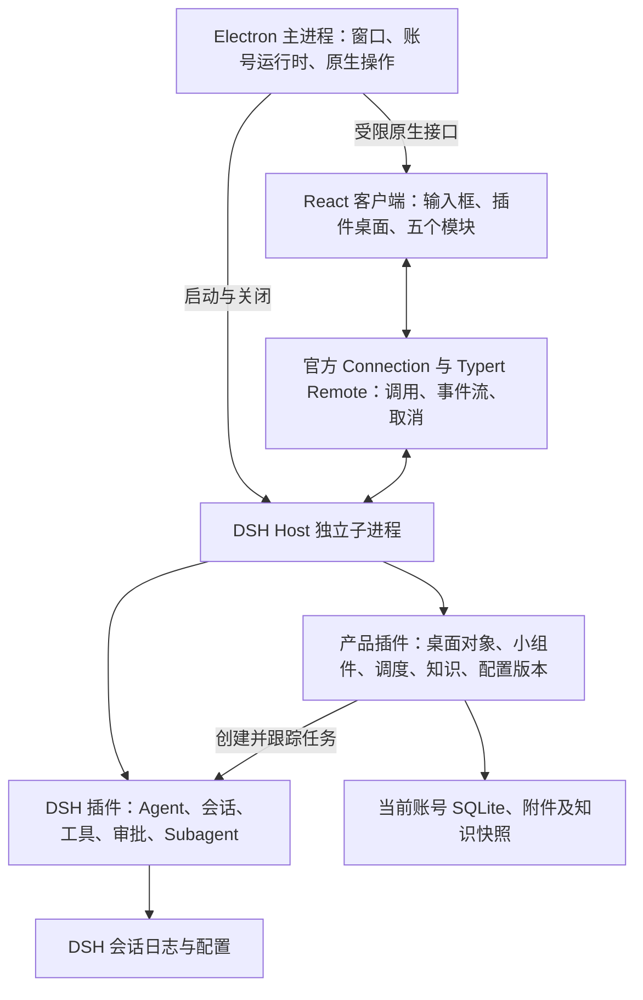

# 桌面端与 DSH 接入建议

统一产品功能与技术架构见[完整产品方案（修订 11）](../product/outline.md)。本页作为工程详细说明与研究依据；当前实现、待开发能力及开工范围以整合版为准。

更新：2026-09-20。方案修订 8。当前 alpha.2 已实现独立 Electron 壳、包内 Node、官方 DSH Web profile 与 Harness 产品插件；新增自进化基础为待实现设计。下文标注长期建议与上游参考，当前运行结构和缺口以本文“P1 实施选择”及[进化基础设计](evolution-foundation.md)为准。

## 结论

产品底层同时服务两个目标：日常使用方便，以及从真实任务持续改进。日常助手沿用当前 Electron、React Client、DSH Host 与官方会话通道；自进化在其上增加任务证据、反馈、候选、验证与采用记录，优先用插件和既有服务扩展，不修改执行循环。

当前实现使用独立薄桌面壳，固定 Electron 43.2.0、Node 24.19.0 和 DSH 0.1.7-rc.2（2026-09-26 起；此前为 0.1.6-alpha.2）。产品配置为原子 JSON，DSH 保存会话事实；SQLite 等存储按实际查询需求引入。详细对象、版本冲突、隔离验证及实现次序以[自进化底层设计](evolution-foundation.md)为唯一来源。



以下五模块、调度与知识存储内容保留为长期建议，不要求 MVP 提前实现；原官方壳参考不等于当前产品直接采用其全部发布系统。当前阶段仍是 macOS Apple Silicon。

## 上游已有的界面能力

以下是固定在 `dsh-v0.1.6-alpha.2` 源码上的能力核查，不等于本产品已实现所有相关功能。路径均相对上游仓库，版本与定位入口见[上游记录](upstream.md)。

| 来源 | 已有能力 | 本产品使用方式 |
| --- | --- | --- |
| `apps/desktop/` | Electron 壳、原生目录选择、Host 子进程管理、打包与更新流程 | 保留运行机制，适配产品名称、应用标识、数据目录和发布配置 |
| `apps/web/`、`packages/client/web/` | React Web 客户端，桌面端复用同一套界面 | 用产品 Client 插件组成五个模块 |
| `packages/client/ui-conversation/`、`ui-chat/`、`ui-approval/`、`ui-user-questions/`、`ui-subagent/` | 输入、对话、工具展示、授权、提问与子任务 | 复用真实任务交互，避免复制一套执行状态 |
| `packages/client/ui-deliverables/`、文件/文档/终端/浏览器侧栏插件 | 产物、文档、文件、终端及网页预览 | 扩展“Pin 到首页”与输入引用 |
| `packages/client/ui-plugin-manager/`、`ui-settings-plugin-inventory/`、`ui-skill/` | 插件管理、清单与 Skill 调用 | 作为能力广场的底层能力，产品分类与配置流程另做 |
| `packages/client/ui-slots/`、`ui-renderer/`、`modules/` | 插槽、React 渲染与动态 Client 插件 | 验证首页替换所需插槽，优先通过插件扩展 |
| `packages/schedule/schedule/`、`packages/client/ui-schedule/` | 会话内定时提醒及可选目录界面 | 可用于会话提醒，不能直接替代账号级小组件调度 |

网页预览目前基于 iframe，并非任意网站都可嵌入；网站限制、登录与跳转需要保留外部打开方式。上游插件管理也不等于本产品的首页插件安装机制，后者仍按产品方案后置。

## 长期模块布局



Electron 主进程管理应用生命周期、当前账号对应的 Host、系统目录选择等原生能力。产品业务服务放在 Host 插件中，避免再引入一个重复处理会话与权限的后端进程。由 Electron 选择并锁定当前账号运行环境，Host 依据这个环境处理请求，不能仅相信界面传来的账号 ID。

上游 Desktop 使用 Electron 的 Node 模式子进程启动共享 profile runner；页面加载打包的 `dsh-app://app/` 资源，经官方认证通道访问 Host。Node IPC 用于启动、就绪和退出；业务请求采用官方 Remote。页面不直接访问 Node、凭证或任意文件，保留来源限制、鉴权及隔离设置。[Electron 安全说明](https://www.electronjs.org/docs/latest/tutorial/security)。

## 接入方式与上游参考

现版本 GUI 通道是 `packages/client/connection`、`packages/api/gateway`、`packages/api/remotes` 与 `packages/api/session-controller`：普通调用通过 HTTP POST，流通过 `/api/remote.mux` WebSocket 多路传输，支持会话操作及取消。新增产品服务需要显式加入产品 Remote 装配，不能假设安装 Host 插件后浏览器就会自动发现全部方法。

旧建议中的 `packages/host/apiproxy` 已不在当前版本，正式工程不再基于它设计。TypeScript stdio SDK 当前仍缺少中途取消及服务端交互请求，因此不作为桌面主通道；它已支持解析同版本 DSH 包或显式 `dshBin`，不再沿用旧的运行时启动说明。

官方桌面包为 private 源码应用。原研究考虑复用官方壳，实际 alpha.2 已选择独立薄壳和固定 npm 运行时依赖，见本文实施选择。自有业务留在独立产品仓库，构建不依赖父级参考源码。

当前上游锁定 React 18.3.1、Electron 44.0.0；现有 Demo 使用 React 19。Demo 提供布局和交互依据，正式 Client 插件须使用上游共享 React 基线，不能把两套 React 运行时直接混装。最终依赖以工程接入后提交的锁文件为准。

DSH 仍是预发布版本，当前已固定 0.1.6-alpha.2 并完成部分集成验证；升级版本必须重新验收。应用壳、DSH、插件、配置模板及数据格式记录在同一个发布清单里；不允许运行时自动升级成未经验证的组合。

## 五个模块的工程分工

| 产品模块 | 复用上游 | 产品新增 |
| --- | --- | --- |
| 首页（HOME-01～07） | 输入、会话、引用、审批、产物与预览 | 同页平铺桌面、文件/网页 Pin、小组件定义与数据、添加入口及生成链路 |
| 能力广场 | Skill、工具、Subagent、插件加载及清单 | 三类能力的产品分类、配置体验、权限范围与实际验证状态 |
| Harness 设置 | 真实插件装配、设置及会话记录 | 可理解的可视化、配置版本、任务反馈、固定任务集比较及回退 |
| 知识库 | 文件读取、会话来源、Agent 工具调用 | 导入索引、可审阅 Wiki、有证据的实体关系及范围过滤检索 |
| 协同 | 本机 Subagent 执行与身份基础能力 | 按当前草案先做本地对象与任务草稿；跨人网络、信任和传输另行设计 |

Harness 视图来自真实运行配置，保存与应用分开；新任务绑定配置版本，不在任务中途偷偷替换。知识检索作为工具插件接入，输入模型的知识须能从会话记录重建。知识初期可用 SQLite 全文检索、来源表与关系表，不急于增加独立图数据库或向量服务；检索评测出现具体缺口后再补。

## 首页小组件的执行链路

首页“添加”把组件开发 Skill 和当前需求带入输入框。Skill 指导 Agent 产出组件定义、执行任务、结果字段与展示方式；预览与启用流程按产品方案对齐后实现。Pin 是首页布局操作，定时启用是执行操作，两者分别保存，取消 Pin 不自动删除任务或原始产物。

```text
添加 → 输入框携带 Skill → DSH 开发组件 → 试跑与预览 → Pin
计划到期 → 产品调度器 → DSH 执行任务 → 校验并保存数据 → 通知前端刷新
```

建议组件定义包含稳定 ID、账号、版本、来源 Skill/会话、任务指令、所需能力、调度计划、结果字段和展示描述。每次运行记录独立运行 ID、组件版本、计划时间、DSH 会话定位、状态和错误；成功结果原子发布，较早运行的晚到结果不得覆盖新结果。前端显示最近一次成功数据及其时间，失败保留旧数据并标明状态；每次渲染不重新调用模型。

推荐先用受支持的展示组件和结构化数据承载小组件；确需生成 HTML/JavaScript 时，在单独的受限展示环境中运行，只通过允许的消息读取组件数据或申请操作，不获得 Host RPC、Node 或凭证。此选型仍是建议，不将其当作用户已确认的组件能力限制。普通生成小组件不能默认作为拥有完整 Host 权限的 Cordis 插件安装；上游 Client 模块共享页面环境，也不是运行任意生成代码的安全沙箱。

## 定时任务需要补齐什么

上游 Schedule 是持久化的会话提醒：必须有活跃 root Agent 才会投递；冷会话等到恢复后处理。固定间隔至少 300 秒，不支持“每个工作日上午九点”一类日历重复规则；记录已投递也不等于模型执行成功。Jobs 用于运行中的长任务跟踪，不能替代持久化调度器。上游 Schedule 的存在不能作为首页后台更新已实现的证据。

建议新增账号级调度服务，以 SQLite 保存计划和运行记录，负责时区、下次触发、暂停、恢复、执行占用和结果发布；到期通过 DSH 执行已绑定配置的任务，不修改上游会话提醒语义。对恢复后的重复触发进行去重，执行器使用可恢复的占用记录；外部副作用仍需业务幂等，不能承诺崩溃下严格只执行一次。

建议初期同一组件不重叠运行，前台与后台分别排队，前台优先，后台并发有明确上限；漏跑默认合并为一次最新更新，失败重试次数有上限。后台任务遇到需要审批或补充信息时进入等待状态并在产品中展示，不能自动扩大授权。这些是待对齐的产品行为，需先补入方案和 Demo，再实现。

本地调度的运行前提是当前账号 Host 存活。窗口关闭是否保持应用驻留需要明确；应用完全退出、电脑休眠或切换到另一账号时不承诺准时执行。初期建议只运行当前激活账号，重新激活后按漏跑策略恢复。全天候运行需要后续系统后台服务或远程执行环境，不是一个调度开关就能提供。

## 账号、存储与恢复

本地账号使用稳定产品 ID，上游匿名 ID 用于遥测等用途，不能充当账号权限。系统应用数据目录只保留账号索引；每个账号独立保存产品数据库、DSH home/profile、凭证引用、附件与知识快照。自有产品使用自己的数据根目录，避免直接共用用户官方 DSH 的默认 home。凭证建议经系统钥匙串与凭证提供器接入，实际能力在工程阶段验证。

DSH 会话日志是执行事实来源；产品 SQLite 保存布局、快捷方式、组件、计划、运行索引、知识来源和配置版本，通过会话 ID 与日志位置关联，不复制一份独立的聊天真相。账号切换先处理旧任务并关闭旧 Host，晚到事件按账号和运行时实例校验；插件实际写盘位置仍要逐个验证。

应用升级前备份兼容的数据与配置。当前上游已使用 Session 格式 V3；切回旧代码不代表旧内核能读取新日志或数据库。回退须同时选择兼容应用和迁移前数据快照，先在独立目录验证，不能直接覆盖用户现有资料。

## 目录与交付建议

保留当前 `engineering/` 划分：`apps/` 管桌面壳及产品 UI 装配，`harness/` 管固定上游来源、Profile/Bundle 和配置版本，`plugins/` 管首页、账号、调度、知识等产品插件，`tests/` 管真实组合验证，`scripts/` 管构建和打包。当前实现集中在 `apps/desktop/`；新增进化职责先在现有插件中明确，再按独立演进需要拆包。

产品打包沿用官方机制，把匹配版本的运行时与资源一起交付，不依赖开发服务器、父级仓库或用户另外安装 Node。自有应用必须配置独立应用标识、品牌、数据目录、签名和更新策略，不沿用官方更新服务来更新我们的定制产品。首期本地安装包与后续公开签名分发分别验收。

## 实施顺序与验收

当前 P1 为对话与 Harness 管理，详细行为见[第一期设计](../product/features/harness-capabilities.md)，阶段与状态以[功能清单](../product/outline.md)为准。现有上游清单与装配能力优先复用，不能把静态配置直接当作真实运行状态；缺少状态数据时需明确标为未知，并核验所需 Host 查询或事件扩展。自有 MCP 接入和单工具控制支持范围须真实验证后确定，不直接承诺任意服务类型均可用。

1. 对齐“对话 + Harness”两入口及装配、应用、状态、调用来源和回退的 Demo，再记录正式开发范围。
2. 验证官方壳与固定 DSH 的真实对话、工具调用、审批、提问、取消、断线与历史；建立首个本地账号、凭证范围和运行配置版本关联。
3. 实现并验证 Tool、Skill、至少一种 MCP 接入及已有 Subagent 预设的装配；显式区分草稿、期望配置和实际加载状态，新增产品查询和操作纳入受控 Remote 装配。
4. 对话绑定实际使用的配置版本与能力来源。修改配置后新对话使用新版本；保留运行中会话的版本关系，旧版本无法重建时明确失败，不静默迁移。手动回退校验依赖和凭证引用，应用失败保留可用配置。
5. 在独立安装包中验收“配置 → 应用 → 状态 → 对话调用 → 修改/回退”，并演练会话与配置的兼容恢复，形成建议的 P1/v0.1 交付。
6. P1 补齐任务/实际版本关联、明确反馈、一个 Skill 候选、独立比较和采用记录，完成受控进化闭环；具体顺序见[进化基础](evolution-foundation.md)。
7. P2 以后扩展插件桌面、复杂管理、小组件、知识及协同；P5 完善批量评估和自动化，不作为 P1 最小闭环的前置条件。

alpha.2 的实现和验证见[008](../iterations/008-desktop-alpha.md)与[009](../iterations/009-focus-brand.md)。修订 8 本轮只更新设计，未开发新闭环；长期调度与知识服务仍不要求 P1 预先实现。

## P1 实施选择（2026-09-20）

用户已授权开发。首个本地版本使用独立 Electron 壳启动固定版本的官方 `dsh --profile web`，加载官方完整 Web 客户端；产品插件注册 Harness 管理页面，保留官方会话通信与审批。不复制整个官方发布系统，先以无自动更新的本地应用包交付；官方壳的进程隔离与生命周期原则沿用。运行时作为精确依赖随包分发，不依赖父级源码。该实施选择减少对官方私有 Desktop Host 与官方更新服务的耦合，仍通过受支持的 profile 启动。业务管理优先复用 Host 插件服务，状态必须来自真实运行数据。

### Alpha.1 实际运行时

桌面壳固定 Electron 43.2.0；DSH 固定 0.1.6-alpha.2，由随包附带的独立 Node 24.19.0 子进程启动。实际验证发现 DSH 原生加载器仅识别特定 Electron/V8 指纹，因此不使用 Electron 内嵌 Node。Client 通过官方 Connection 的鉴权同源 fetch 路由访问产品管理插件，会话继续使用官方 Typert。产品配置保存为原子 JSON 与不可变 preset 版本；会话持久化由官方 DSH 承担。本版不另外建立产品数据库。

## 模式管理扩展设计（2026-09-23，待开发）

产品模式、草稿、不可变版本、会话实际配置及迁移方案统一见[模式管理设计](../product/features/harness-modes.md#技术架构与数据)。与现有实现相比，需要替换全局单 draft/versions 结构，解除固定 standard 来源和发布即设默认的耦合；每个版本仍落为独立 DSH preset，不改执行循环。模型默认策略和权限建议在创建会话前显式解析；实际参数按任务记录，不能将 Host 设置全部放进 preset。先验证空会话配置与创建原子性、模板字段支持及子 Agent 继承限制，再按确认范围实施。

修订 11 统一将内置及自定义 Harness 配置称为“模式”，支持内置定制与恢复，详见[模式管理方案](../product/features/harness-modes.md)；本轮仅设计更新，应用仍为 alpha.4。

## alpha.5 模式管理实现

`plugin/config.mjs` 校验并编译四类型装配；`modes.mjs` 管理独立草稿、迁移、差异和候选采用；`host.mjs` 通过官方认证通道暴露串行 RPC、不可变发布和真实会话观测。默认切换用持久化日志在重启时补完；模式状态与用户 DSH 日志各自保存。前端复用 React 表单与 JSON 文本编辑，不接受任意 Cordis/JavaScript 插件程序。详情见[修订 12](../product/features/harness-mode-editor.md)。
