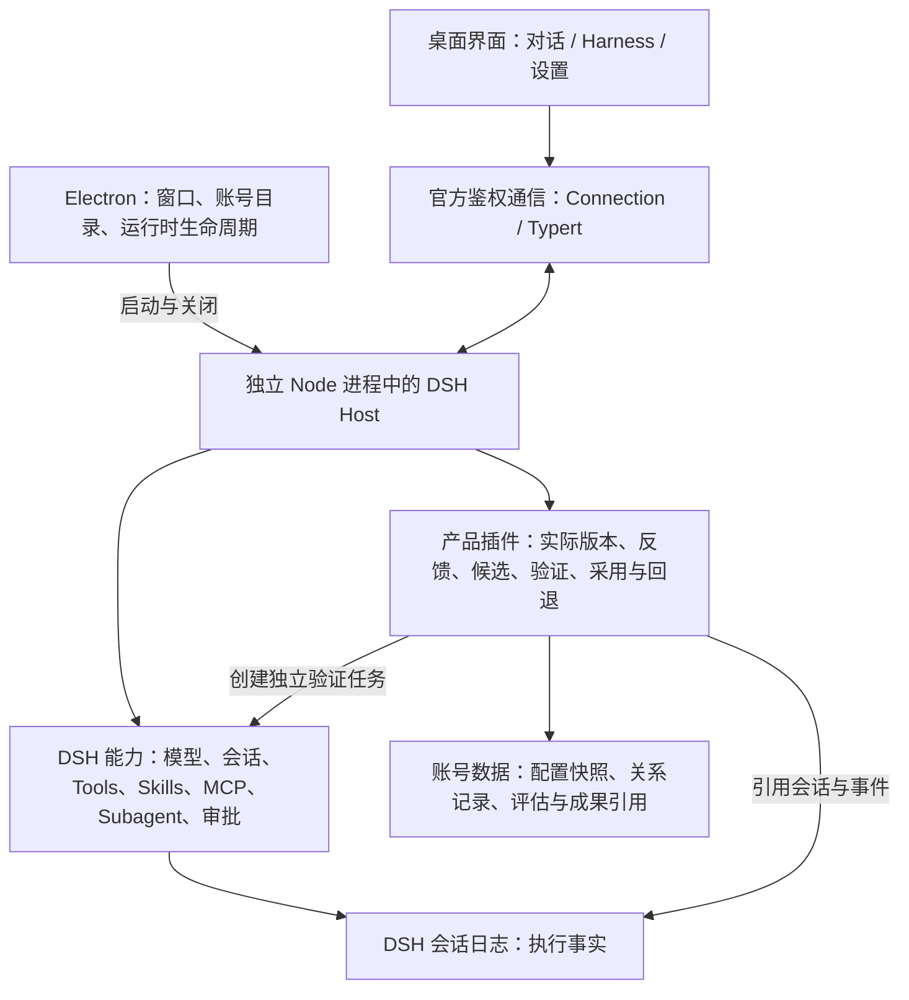

# 技术架构

> 关联：[产品大纲](../product/outline.md) · 工程研究见[架构研究](architecture-proposal.md)与[进化对象与实现约束](evolution-foundation.md) · 上游跟进见[上游接入记录](upstream.md)。

本页是产品技术架构的工程入口：Focus Workspace 以 DSH 执行，以产品插件管理经验与改进。变更架构前先更新本页，并在对应迭代文档记录原因。

## 5.1 总体结构



执行循环、工具和模型接入复用 DSH。Focus Workspace 补齐产品体验、账号范围、真实版本关联、任务反馈、候选比较及采用记录。执行与改进职责分开，先在现有 Host 插件内实现清晰模块，不要求拆成多个服务。

## 5.2 技术选择与职责

| 层 | 选择 | 负责什么 |
| --- | --- | --- |
| 桌面壳 | Electron 43.2.0，首期 macOS Apple Silicon | 窗口、菜单、账号运行环境、内核启动/退出和故障提示 |
| 界面 | React 18.3.1 + DSH 官方 Client 插件与产品插件 | 复用对话、历史、审批和成果，增加能力管理及进化交互 |
| 执行内核 | DSH 0.1.6-alpha.2，包内独立 Node 24.19.0 | 通过官方 `web` profile 启动，执行真实任务与工具，不依赖开发目录 |
| 通信 | 官方 Connection / Typert；产品管理使用已鉴权的同源接口 | 会话操作、流式事件与管理动作，页面不直接访问 Node 或凭证 |
| 产品业务 | 自有 Host/Client 插件 | 能力版本、任务证据、反馈、候选、验证和采用关系 |
| 数据 | DSH 持久化日志 + 账号内原子 JSON / 文件快照 | 日志保存执行事实，产品保存补充关系；查询需求增大后再引入 SQLite |

版本基于当前已验证的安装组合，后续升级需单独验证。使用独立 Node 是因为 DSH 原生加载器对 Electron 内嵌运行时的小版本有限制；应用随包携带运行时，用户无需另装 Node。外部 MCP 命令依赖的程序仍需另外具备。

## 5.3 利用 DSH 特性实现进化

| DSH 特性 | Focus Workspace 的用法 |
| --- | --- |
| 插件、服务与事件扩展 | 观察结果、生成候选、验证和采用通过插件接入，优先不修改执行循环 |
| 模式配置与 Agent Presets | 当前版本和候选拥有独立身份，任务关联具体装配，采用后更新目标模式的新会话版本，不自动改变账号默认 |
| 会话事件和工具记录 | 反馈、评估和成果引用同一份执行证据，不重复维护聊天历史 |
| Tool、Skill、MCP、Subagent | 作为可管理、可组合、可逐步改进的能力单位 |
| 插件释放与重新装配 | 支持调整装配生命周期，但不将其当作撤销文件或外部服务副作用的机制 |

可装配框架提供实现条件，产品仍需自己证明改进有效。普通执行使用已采用版本；改进任务输出候选，候选验证通过后才有资格被采用。

## 5.4 从 MVP 建立的数据关系

```text
本地账号 → 工作区 → 任务运行 → 实际配置版本 / 会话事件 / 成果
                         ↓
                       用户反馈 → 改进候选 → 比较验证 → 采用或回退记录
```

| 记录 | 保存的核心信息 |
| --- | --- |
| 任务运行 TaskRun | 账号、工作区、会话/事件位置、输入与成果引用、实际版本、状态和可取得的耗时/用量 |
| 模式与草稿 HarnessDefinition / HarnessDraft | 稳定模式 ID、用途、内置来源与原版、当前发布指针、本地定制、独立草稿及基准修订号 |
| 配置版本 HarnessRevision | 父版本、DSH 和应用版本、preset 与 Skill 快照、工具来源、实际模型参数、指令/上下文与权限依据 |
| 用户反馈 Feedback | 来源任务、结果评价、明确纠正、作用域、作者与时间；与 Agent 推断分开 |
| 改进候选 ImprovementCandidate | 基准版本、来源反馈、目标、差异、依赖与状态 |
| 验证 Evaluation | 固定输入和规则版本、基准与候选运行、逐项结果、环境差异和未验证项 |
| 采用记录 Adoption | 采用/拒绝/回退的版本、证据、原因、操作者与生效范围 |

实际版本不能只保存 preset 名称：模型设置、权限和上下文也可能改变。可快照的能力保存快照，外部可变服务记录版本或不可冻结限制；无法取得的信息明确标未知，不假装能够精确重演所有任务。

## 5.5 执行、验证与恢复规则

- **任务不中途换配置**：采用只影响后续新任务；旧会话继续使用前检查旧依赖和实际环境，有差异明确展示。
- **候选不覆盖当前能力**：生成与验证使用独立版本和工作目录，保留用户源 Skill。独立 preset 不自动等于文件或网络隔离。
- **验证不盲目重放外部动作**：文件案例在复制的输入与测试输出目录运行，发信、发布等使用受控目标或标为未验证。
- **失败保留可用版本**：加载失败、效果不合格或证据不足不自动采用；当前默认已变化时，旧候选需重新核对或验证。
- **采用过程可恢复**：操作串行、记录证据、原子切换默认版本，重启后能识别未完成状态，避免重复采用。
- **三种版本分开管理**：应用代码、Harness/Skill 配置、用户数据分别保存与恢复。配置回退不撤销已发生的外部动作，代码回退不代替数据恢复。

未来的自动采用仍要遵循同一套来源、验证、作用域和回退机制。新增权限、凭证、外部发布及产品内核变更使用各自明确授权，不能被一个“自进化”开关统包。
