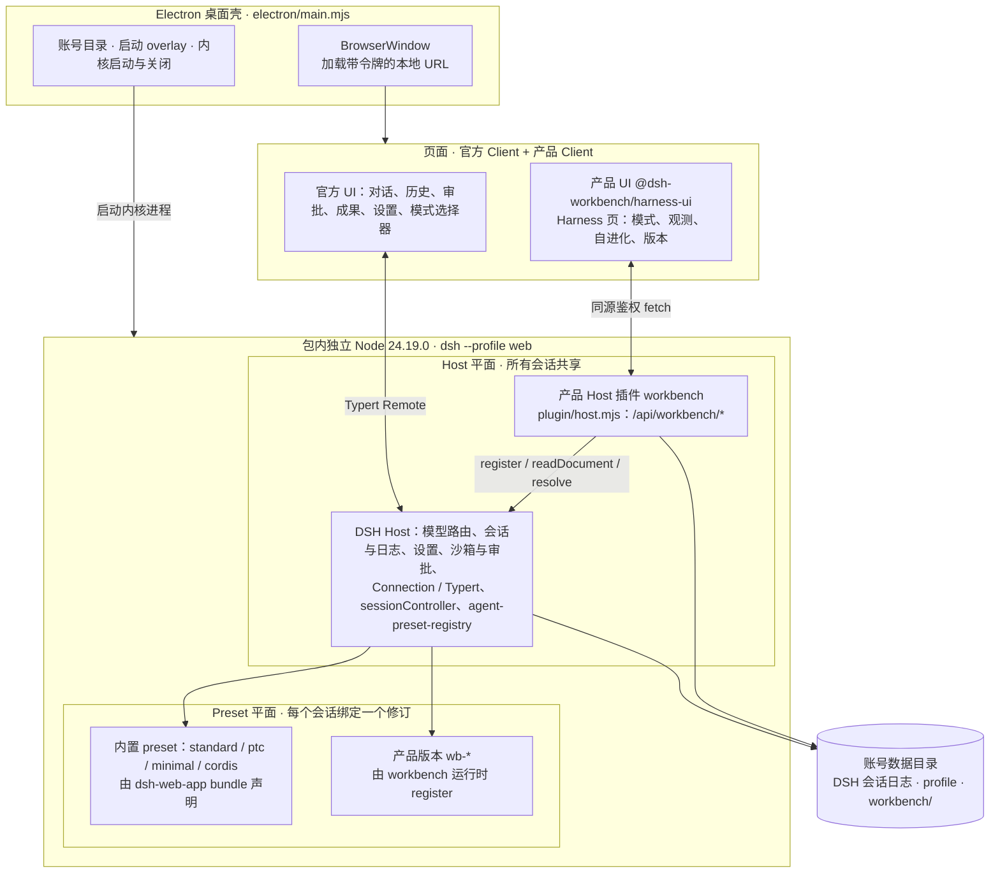

# 技术架构

> 关联：[产品大纲](../product/outline.md) · 工程研究见[架构研究](architecture-proposal.md)与[进化对象与实现约束](evolution-foundation.md) · 上游跟进见[上游接入记录](upstream.md)。

本页是产品技术架构的工程入口：Focus Workspace 以 DSH 执行，以产品插件管理经验与改进。变更架构前先更新本页，并在对应迭代文档记录原因。

## 5.1 总体结构

三句话：Electron 只管窗口和内核进程；DSH 负责执行，包括模型、工具、会话、审批和 preset 注册表；产品插件负责模式版本、观测与自进化，以及这些数据的账号归属。


```mermaid
flowchart TB
    subgraph Desktop["Electron 桌面壳 · electron/main.mjs"]
        WIN["BrowserWindow<br/>加载带令牌的本地 URL"]
        LIFE["账号目录 · 启动 overlay · 内核启动与关闭"]
    end
    subgraph NodeProc["包内独立 Node 24.19.0 · dsh --profile web"]
        subgraph HostPlane["Host 平面 · 所有会话共享"]
            DSHH["DSH Host：模型路由、会话与日志、设置、沙箱与审批、<br/>Connection / Typert、sessionController、agent-preset-registry"]
            WB["产品 Host 插件 workbench<br/>plugin/host.mjs：/api/workbench/*"]
        end
        subgraph PresetPlane["Preset 平面 · 每个会话绑定一个修订"]
            BUILTIN["内置 preset：standard / ptc / minimal / cordis<br/>由 dsh-web-app bundle 声明"]
            VERS["产品版本 wb-*<br/>由 workbench 运行时 register"]
        end
    end
    subgraph Client["页面 · 官方 Client + 产品 Client"]
        OFF["官方 UI：对话、历史、审批、成果、设置、模式选择器"]
        HUI["产品 UI @dsh-workbench/harness-ui<br/>Harness 页：模式、观测、自进化、版本"]
    end
    ACC[("账号数据目录<br/>DSH 会话日志 · profile · workbench/")]
    LIFE -->|启动内核进程| NodeProc
    WIN --> Client
    OFF <-->|Typert Remote| DSHH
    HUI <-->|同源鉴权 fetch| WB
    WB -->|register / readDocument / resolve| DSHH
    DSHH --> BUILTIN & VERS
    DSHH --> ACC
    WB --> ACC
```

- **Host 平面与 Preset 平面**沿用 DSH 0.1.7 的划分：一个 Host 进程同时运行多套模式，每个会话只绑定一个 preset 修订。模式之间互不影响，旧会话保留自己的修订。
- **产品只用公开扩展点**：profile overlay、Host 插件、Client 插件、`agentPresets.register()`、Typert Remote。执行循环不改；依赖清单见[上游接入记录](upstream.md#依赖的上游接口)。
- **产品管理接口**由 Host 插件注册在官方 Connection 下（`/api/workbench/<action>`），使用同一套浏览器鉴权；所有修改操作经串行队列执行，并用草稿修订号防止覆盖。

## 5.2 技术选择与职责

| 层 | 选择 | 负责什么 |
| --- | --- | --- |
| 桌面壳 | Electron 43.2.0，首期 macOS Apple Silicon | 窗口、菜单、账号运行环境、内核启动/退出和故障提示 |
| 界面 | React 18.3.1 + DSH 官方 Client 插件与产品插件 | 复用对话、历史、审批和成果，增加能力管理及进化交互 |
| 执行内核 | DSH 0.1.7-rc.2，包内独立 Node 24.19.0 | 通过官方 `web` profile 启动，执行真实任务与工具，不依赖开发目录 |
| 通信 | 官方 Connection / Typert；产品管理使用已鉴权的同源接口 | 会话操作、流式事件与管理动作，页面不直接访问 Node 或凭证 |
| 产品业务 | 自有 Host/Client 插件 | 能力版本、任务证据、反馈、候选、验证和采用关系 |
| 数据 | DSH 持久化日志 + 账号内原子 JSON / 文件快照 | 日志保存执行事实，产品保存补充关系；查询需求增大后再引入 SQLite |

版本基于当前已验证的安装组合，后续升级需单独验证。使用独立 Node 是因为 DSH 原生加载器对 Electron 内嵌运行时的小版本有限制；应用随包携带运行时，用户无需另装 Node。外部 MCP 命令依赖的程序仍需另外具备。

### 代码模块（`apps/desktop/`）

| 位置 | 职责 |
| --- | --- |
| `electron/main.mjs` | 建立账号目录，写启动 overlay（模型目录；停用官方插件管理页、官方品牌和热更新；插入 `workbench`），启动并关闭内核进程 |
| `plugin/host.mjs` | 产品 Host 插件：启动时迁移并注册版本；管理接口（快照、创建、保存草稿、发布、设默认、恢复、归档、检查、观测、反馈、生成、候选、试跑、证据、采用、差异） |
| `plugin/config.mjs` | 草稿字段校验（Zod），把草稿编译成插件行：`composePlugins`、`parseRows`、`withSkillRoots` |
| `plugin/presets.mjs` | 版本定义存储（只写一次）与 alpha.5 目录迁移 |
| `plugin/modes.mjs` | 模式、草稿、版本、反馈、候选的状态结构与规则（schema 2、修订冲突、候选采用） |
| `plugin/store.mjs` | 原子 JSON 写入与串行队列 |
| `plugin/model-catalog.mjs` | 模型目录，经 overlay 提供给 DSH |
| `plugin/src/*` → `plugin/client.js` | 产品 Client（Harness 页），由官方模块加载器加载 |
| `scripts/` | 构建（含首页标语替换）、隔离启动 `dev-host`、集成验证 `verify-host` / `verify-restart`、运行时打包 |

### 账号数据布局

```text
<数据目录>/                     默认 ~/Library/Application Support/DSH Workbench/
├── browser/                    窗口偏好
├── workspace/                  默认检查工作区
└── accounts/local/             = DSH_HOME
    ├── account.json            本地账号 ID
    ├── workbench.patch.yml     启动 overlay，每次启动重写
    ├── profiles/web/           DSH profile；cordis.patch.yml 保存 selectedDefault（账号默认模式）
    ├── sessions/               DSH 会话日志（v4，迁移时保留 v3）
    ├── storages/、.credentials.yaml   DSH 管理
    ├── workbench/              产品数据
    │   ├── state.json          模式、草稿、版本列表、反馈、候选、操作记录（schema 2）
    │   ├── presets/<id>.json   不可变版本定义（插件行 + Skill 相对路径）
    │   ├── skills/<id>/        冻结的 Skill 副本
    │   └── migrations.json、default-transition.json   迁移标记与默认切换日志
    └── .agent-presets/         alpha.5 旧版本目录，只读保留
```

### 关键流程

1. **启动**：Electron 启动内核 → DSH 加载 bundle 与 overlay → `workbench` 迁移旧目录，并在会话恢复前注册全部版本定义 → Loader 加载完成后，串行队列第一项处理默认模式迁移与中断恢复 → 页面可用。
2. **发布**：校验草稿修订号 → 读取所选类型的官方插件行并编译 → 冻结 Skill → `register()` → 读取激活诊断 → 建立检查会话并发现工具与 MCP → 保存定义 → 更新模式当前指针。任一步失败都注销该版本并删除其文件，保留旧版本。
3. **使用**：新会话按显式选择或账号默认解析到具体 preset id；会话日志记录这个 id，之后一直用它，模式发布新版本也不影响已有会话。
4. **观测与改进**：观测从 `sessionController.inspect` 读取指定会话的实际版本、模型和工具结果。改进任务、候选试跑各自使用独立版本和独立会话；只有人工记录对照证据后，候选才能采用到草稿，再走正常发布。

### 产品支柱到技术组件

| 支柱 / 模块 | 技术落点 | 现状 |
| --- | --- | --- |
| 模式与按需组合 | 版本定义 + `register()`；按需组合为派生定义 | 模式已实现；按需组合待做（迭代 018 第 3 步） |
| 能力装配与现状、上下文可视 | `readDocument`、`compositionInventory()`、`sessionController.projections` 与会话日志重建 | 装配与检查已实现；上下文可视待做（第 2 步） |
| 自进化 | 反馈、候选、试跑会话、证据、采用；Skill 文件候选 | 配置候选已实现；Skill 候选待做（第 4 步） |
| 对话 | 官方 Client | 已接入 |
| 系统连接 | preset 内的 `dsh-mcp-client`（stdio） | 本地 stdio 已实现；远程与凭证后置 |
| 工作台、主动性、知识库、网络 | 未开始；按同一原则作为插件与可装配能力接入 | P2 起 |
| 账号与数据 | 每账号一个 DSH_HOME；三类数据分开恢复 | 首个账号已实现，多账号 P2 |

## 5.3 利用 DSH 特性实现进化

| DSH 特性 | Focus Workspace 的用法 |
| --- | --- |
| 插件、服务与事件扩展 | 观察结果、生成候选、验证和采用通过插件接入，优先不修改执行循环 |
| Preset 注册表（0.1.7 `agent-preset-registry`） | 每个版本和候选有独立 preset id，运行时注册；会话绑定具体修订，采用后只影响该模式的新会话，不自动改变账号默认 |
| 会话事件和工具记录 | 反馈、评估和成果引用同一份执行证据，不重复维护聊天历史 |
| 会话投影与实际装配清单 | `sessionController.projections`（token、上下文占用与构成）和 `compositionInventory()` 作为可控可见的数据来源 |
| Tool、Skill、MCP、Subagent | 作为可管理、可组合、可逐步改进的能力单位 |
| 修订保留与释放 | 注册表保留仍被会话使用的旧修订；这不能撤销文件或外部服务的副作用 |

可装配框架提供实现条件，产品仍需自己证明改进有效。普通执行使用已采用版本；改进任务输出候选，候选验证通过后才有资格被采用。

## 5.4 从 MVP 建立的数据关系

```text
本地账号 → 工作区 → 任务运行 → 实际配置版本 / 会话事件 / 成果
                         ↓
                       用户反馈 → 改进候选 → 比较验证 → 采用或回退记录
```

| 记录 | 保存的核心信息 |
| --- | --- |
| 任务运行 TaskRun | 账号、工作区、会话/事件位置、输入与成果引用、实际版本、状态和可取得的耗时/用量 |
| 模式与草稿 HarnessDefinition / HarnessDraft | 稳定模式 ID、用途、内置来源与原版、当前发布指针、本地定制、独立草稿及基准修订号 |
| 配置版本 HarnessRevision | 父版本、DSH 和应用版本、preset 与 Skill 快照、工具来源、实际模型参数、指令/上下文与权限依据 |
| 用户反馈 Feedback | 来源任务、结果评价、明确纠正、作用域、作者与时间；与 Agent 推断分开 |
| 改进候选 ImprovementCandidate | 基准版本、来源反馈、目标、差异、依赖与状态 |
| 验证 Evaluation | 固定输入和规则版本、基准与候选运行、逐项结果、环境差异和未验证项 |
| 采用记录 Adoption | 采用/拒绝/回退的版本、证据、原因、操作者与生效范围 |

实际版本不能只保存 preset 名称：模型设置、权限和上下文也可能改变。可快照的能力保存快照，外部可变服务记录版本或不可冻结限制；无法取得的信息明确标未知，不假装能够精确重演所有任务。

## 5.5 执行、验证与恢复规则

- **任务不中途换配置**：采用只影响后续新任务；旧会话继续使用前检查旧依赖和实际环境，有差异明确展示。
- **候选不覆盖当前能力**：生成与验证使用独立版本和工作目录，保留用户源 Skill。独立 preset 不自动等于文件或网络隔离。
- **验证不盲目重放外部动作**：文件案例在复制的输入与测试输出目录运行，发信、发布等使用受控目标或标为未验证。
- **失败保留可用版本**：加载失败、效果不合格或证据不足不自动采用；当前默认已变化时，旧候选需重新核对或验证。
- **采用过程可恢复**：操作串行、记录证据、原子切换默认版本，重启后能识别未完成状态，避免重复采用。
- **三种版本分开管理**：应用代码、Harness/Skill 配置、用户数据分别保存与恢复。配置回退不撤销已发生的外部动作，代码回退不代替数据恢复。

未来的自动采用仍要遵循同一套来源、验证、作用域和回退机制。新增权限、凭证、外部发布及产品内核变更使用各自明确授权，不能被一个“自进化”开关统包。
