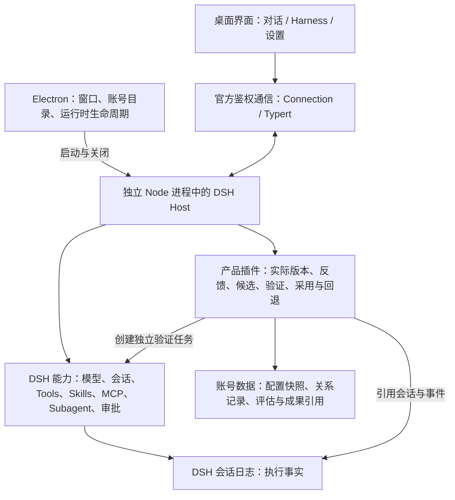

# Focus Workspace · 产品方案

**think different**

方案：0.1-draft，修订 12（可编辑模式与模式内观测、进化）｜日期：2026-09-23｜状态：用户已授权先更新方案并实现本次模式管理迭代。

本文是产品定位、功能范围、核心交互、技术架构和交付验收的统一审阅入口。当前桌面版本为 0.1.0-alpha.5，只实现其中部分能力；本文描述目标产品，实际完成情况见第八节。既有专题文档作为详细设计参考，功能编号和逐项进度继续由功能清单维护。

## 一、产品定位：好用，并且能够持续进化

**Focus Workspace 是一个以 DSH 为内核的个人 Agent 工作台：帮助用户方便地完成日常工作，并从真实任务与反馈中持续改善自己的工作能力。**

| 核心目标 | 对用户的价值 | 衡量方式 |
| --- | --- | --- |
| 自己使用方便的 Agent 助手 | 对话即可开展工作，方便引用资料、调用能力、查看成果、继续修改和人工接管 | 任务完成率、成果可用性、完成耗时、人工纠正及重复说明次数 |
| 基于 DSH 的自进化 Agent | 把任务经验和用户纠正变成可复用的方法与能力，逐渐适应用户的工作方式 | 改进前后结果有证据，采用后有效，效果退化可回退 |

两个目标从 MVP 就共同约束产品和架构。日常使用提供真实需求和反馈，自进化把改进带回后续工作。MVP 先跑通一次用户参与的改进闭环，后续逐步提高自动化程度。

项目作者是首个实例用户，产品能力面向未来其他用户设计。个人资料、偏好、凭证和改进历史属于账号，不写死在产品代码中。首期在本地创建账号，无需邮箱、密码或云端注册；调用在线模型时仍需配置自己的模型服务。

## 二、产品结构与功能全景

第一期保留两个主要入口：**对话**与 **Harness**，另有基础设置。对话负责做事，Harness 负责管理能力与改进做法；普通任务无需先理解内部插件结构。

| 功能分区 | 完整产品功能 | 分期 |
| --- | --- | --- |
| 对话与任务 | 输入、流式回复、工作区与文件引用、执行过程、审批、提问、停止、成果、历史与继续修改 | P1 |
| Harness 与能力管理 | 四种内置模式及自定义模式，独立装配与版本；查看模型、指令、工具、Skill、MCP、Subagent 和权限的配置及实际状态 | P1；复杂能力编辑 P2 |
| 自进化 | 任务反馈、Agent 改进候选、效果验证、采纳与回退；逐步扩展自动发现和自动采用 | 最小闭环 P1；批量与自动化 P5 |
| 本地账号与设置 | 数据归属、模型连接、基础权限、备份恢复；后续多账号切换 | 首个账号 P1；多账号管理 P2 |
| 首页插件桌面 | 输入框与平铺桌面同页；文件、网页、成果可 Pin，支持布局保存 | P2 |
| 定时任务小组件 | 首页“添加”携带 Skill 进入对话，开发并试跑组件，再 Pin；任务产出数据驱动组件刷新 | P3 |
| 知识库 | 工作区和会话整理为可审阅 Wiki、带证据的知识图谱，支持按范围检索与引用 | P4 |
| Agent 协同 | 自己的 Agent 与其他人的 Agent 授权交流、委派任务、回传结果 | P6 |

能力广场的本地装配功能在 P1 统一放入 Harness，后续需要发现、分发和市场能力时再扩展，避免两个地方重复管理。同页插件桌面仍保留长期设计，不增加项目、文件夹或多桌面的管理层级；P1 选择文件工作区只是任务的执行范围，不代表改变桌面设计。

视觉沿用成熟桌面 Agent 的布局：左侧导航与历史，中央对话或管理内容，按需打开成果详情。品牌为 Focus Workspace，slogan 固定为 `think different`。字体家族尚未确认，当前沿用已有字体，不把字体选择作为底层功能设计的前置条件。

## 三、MVP 产品功能与主要交互

### 3.1 对话：完成工作并交付成果

| 功能 | 用户操作与结果 |
| --- | --- |
| 开始任务 | 选择工作区、引用文件、输入需求；可查看本次使用的能力配置摘要 |
| 执行过程 | 流式显示回复，展开真实工具调用与结果，区分执行中、等待用户、完成和失败 |
| 人工控制 | 对具体动作批准或拒绝，回答补充问题，停止任务；失败后保留已完成动作和错误信息 |
| 成果 | 查看或打开实际生成的文件，继续对话修改；成果能返回来源任务 |
| 历史 | 新建、查找、打开和继续会话；重启后读到历史，中断任务不能伪装成自动恢复 |
| 结果反馈 | 标记“可用 / 需要修改 / 失败”，补充原因；选择只修改当前成果，或把纠正用于“改进做法” |

首期围绕一个前台任务优化体验，不额外建设并发队列管理。每次运行保留实际配置、模型和能力来源，方便解释结果和后续比较。用户不必填写反馈才能继续工作。

### 3.2 Harness：看清和管理 Agent 的能力

Harness 内以模式列表为入口，每种模式设置“编辑、运行观测、自进化、版本”，并为改进候选提供详情入口。第一期是实际状态和配置管理，不做任意拖拽式流程编辑器。

| 功能 | MVP 行为 |
| --- | --- |
| 现状总览 | 展示 DSH、配置版本、模型、指令来源、权限及能力关系；可查看当前默认配置和会话实际版本 |
| Tool 管理 | 展示名称、用途、提供方和权限；按运行时真实支持的装配单位启停，不提供没有效果的单工具开关 |
| Skill 管理 | 导入本地 Skill，查看内容、来源、版本与适用范围；启停、验证并保存版本快照，不自动覆盖原目录 |
| MCP 管理 | 第一种接入固定为本地 stdio：配置命令和参数、启停、检查连接、发现工具并展示归属；错误与实际调用分别记录 |
| Subagent 管理 | 查看已装配预设的职责、模型和能力范围，控制已有装配；复杂角色创建和派发编辑后置 |
| 配置草稿 | 修改后先保存，展示差异，检查依赖与加载结果，再发布到该模式；设置账号默认单独操作 |
| 版本与回退 | 查看历史、来源与验证记录，恢复可用旧版本；已有任务不被静默替换，失败应用保留当前版本 |

“已配置、待应用、已加载、可调用、故障、未知”分别展示。发现工具或加载成功不等于实际任务已验证。工具停用也不等于操作系统权限撤销，例如保留终端能力时仍可能通过命令访问文件。

MCP 的 HTTP、OAuth 和通用凭证编辑不作为本次 MVP 必交；stdio 服务若需要登录，首期使用其既有本地授权方式，不能将未实现授权的服务展示为可用。模型连接由基础设置管理。

### 3.2.1 模式管理：内置可用，自定义可增可改（修订 12）

**产品统一使用“模式”这一概念：每种模式就是一套 Harness 工作配置。** 标准、PTC、极简、创造作为四个内置模式直接可选，用户可新增研究、写作、编程等模式，也可修改内置模式细节。界面不再同时要求用户选择模式和另一套 Harness 组合。“内置”表示来源，“启动默认”表示未手选时使用哪一个；默认只能有一个，初始为标准。

四种内置模式复用 DSH 执行循环：标准提供通用工具及上下文装配；PTC 让模型用程序组织工具；极简使用固定提示词和持久终端；创造增加装配检查与开发能力。它们不是能力等级，具体行为、例子和限制见[内置模式说明](harness-modes.md)。完整交互及数据设计见[模式管理方案](harness-compositions.md)。

| 功能 | 用户操作与结果 |
| --- | --- |
| 模式列表 | 初始有四个内置模式，之后与自定义模式统一展示；名称、用途、来源、当前版本、模型 ID、能力摘要、默认和草稿状态清楚可见 |
| 新增模式 | 从内置或已有模式开始，起名并编辑；来源作为初始值及追溯信息，不限制后续受支持的定制 |
| 编辑模式细节 | 配置模型、指令与上下文、工具调用方式、Tools、Skills、MCP、Subagent 和权限建议；依赖变更以差异说明 |
| 定制内置模式 | 在内置模式上直接点编辑，发布后显示“已定制”；产品保存本地新版本，保留安装包中的原版 |
| 恢复原版 / 另存模式 | 可恢复内置原版或另存为新模式；定制历史保留，旧会话不被替换 |
| 检查、试跑与发布 | 区分草稿、加载成功、实际调用和任务效果；发布只更新该模式版本，不自动设为默认 |
| 选择与追溯 | 对话旁只保留一个“模式”选择器，如“研究模式 · v3”；模型单独显示，详情可查看本次实际配置 |
| 独立版本 | 每个模式独立发布、比较和回退；用户模式可归档，内置原版始终可找回 |

编辑器把四种模式拆成可理解的配置维度。工具调用方式可选择直接调用或 PTC；指令策略区分固定完整提示词和组合注入；上下文压缩、能力及装配开发工具按固定版支持开放。不能把 PTC 当作永不可改的模式类别，也不能给固定提示词的极简模式勾选 Skill 后假装已生效；需要补依赖或改变策略时，明确列出关联变更。未支持的转换显示原因，不接受无效发布。

主要链路：选模式并直接使用，或新增/编辑 → 保存草稿 → 检查 → 试跑 → 对比差异并发布 → 开始对话。设为默认另行操作。手动发布但未真实试跑时标注“任务效果未验证”；自进化候选仍需完成既定比较验证。创造模式修改共享 Host 插件不是局部参数编辑，仍按独立授权与安装流程处理，不能绕过产品版本管理。

新会话按显式模式 > 账号默认 > 标准原版解析，工作区默认在 P2 增加。模型按本次选择 > 模式固定值 > 账号默认解析；临时覆盖只记录本次实际值，不改模式。空会话可换模式，有消息后使用另一模式需新建会话。新版本、恢复原版、回退、资产升级均不静默改变旧会话；各次运行记录实际模型、权限和依赖状态。

底层继续使用产品 Host 插件和 DSH preset，每个模式版本对应独立 presetId，包含完整 Cordis 装配及资源快照。产品维护模式身份、内置原版引用、草稿、版本和会话绑定；不改安装依赖的原版文件，不另写 Agent 执行循环。旧单配置迁移保留旧 presetId 与会话关联，缺失历史信息标未知。进化候选只更新明确采用的目标模式。

P1 设计包括四种内置可用、创建/复制、内置定制与恢复、受支持字段编辑、检查试跑、独立版本及对话选择。P2 做工作区默认、导入导出、复杂 Subagent 和更多高级参数；异构子 Agent 仍待验证，固定版默认继承父装配。验收须证明定制和恢复不改原版，A/B 两模式相互独立，旧会话不变，无效依赖与发布冲突有明确结果。alpha.5 已实现模式编辑基础，具体交付范围见修订 12 实施规格；每模式固定模型、权限编辑和对话菜单折叠仍后置。

### 3.3 自进化：让纠正变成下一次的能力

第一期采用 **用户发起 → Agent 生成候选 → 比较验证 → 用户采纳**。先围绕一个本地 Skill 改进方法和输出要求，复用既有装配与版本管理。

1. **提出改进**：在任务成果处点击“改进做法”，选择具体问题和期望结果；默认仅对当前项目有效。
2. **生成候选**：Agent 根据选定任务、执行记录与用户反馈生成独立 Skill 版本，说明改了什么、为什么改、预期改善什么。
3. **查看差异**：展示基准版本、修改内容、作用域与影响；用户可修改、暂存或拒绝。
4. **比较验证**：使用固定输入和预先写明的验收规则，分别检查基准与候选结果；显示有效、无效或证据不足。
5. **采用改进**：用户查看结果后采用，生成新的配置版本，后续新任务使用它；若期间用户已改过默认配置，先重新核对或验证。
6. **继续观察与回退**：后续任务继续关联真实版本；效果退化时恢复旧版本并记录原因。

建议首个案例使用一个目标任务和两个相邻回归任务。结果波动时增加复跑或标记证据不足；不能只凭模型自评分、工具加载成功，或三例通过就宣称普遍提升。模型、输入、权限或依赖变化必须记录，避免错误归因。

**自进化首先改进工作方法、Skill、上下文使用和 Harness 装配。** 后续可以扩展 Subagent 分工、执行策略与新工具/插件生成；批量评测和限定范围自动采用在 P5 完善。训练基础模型、直接改写正在使用的产品内核不属于 MVP。

### 3.4 账号、设置与本地数据

首次使用建立稳定的本地账号 ID 和显示名称；模型、工作区、会话、成果引用、能力配置及进化记录都属于该账号。项目反馈默认留在项目内，只有明确选择才提升为账号通用做法。

设置提供模型连接、必要权限和数据目录入口。凭证独立保存，普通任务、候选、评估和日志索引只记录引用，不回显密钥。首期提供可操作的退出后备份和兼容恢复步骤；多账号切换及完整导入导出管理在后续实现。

模型目录维护（SETTINGS-01，2026-09-23 已获局部更新授权）：选择器直接展示模型名称和实际发送的 model ID，兼容转接信息紧邻该入口；这不表示本地能独立验证服务端权重版本。对齐 DeepSeek 官方公开 API；主要入口为 `deepseek-flash`，显示 DeepSeek-V4.1-Flash。保留 `deepseek-v4-pro` 以兼容已有选择，明确标注当前转接 V4.1-Flash，不再描述为更强的独立模型；不把已退役别名或尚未发布型号列为新增模型。模型 ID、已有会话和用户连接设置保持兼容。依据：[官方发布说明](https://api-docs.deepseek.com/news/news260910/)、[官方模型列表](https://api-docs.deepseek.com/zh-cn/api/list-models/)。本项不代表整合方案或自进化功能已获开工确认。


## 四、用一个完整场景验收产品

以“读取项目资料，生成产品方案与行动清单”为第一条贯穿场景：

1. 用户打开应用，配置模型，选择工作区并装配需要的 Tool、Skill 和 MCP。
2. 发起任务，Agent 读取资料、调用工具，用户处理必要审批，在对话中查看真实成果。
3. 用户发现成果漏了风险和下一步行动，可继续修改当前成果，也可选择让 Agent 改进该类任务的做法。
4. Agent 生成 Skill 候选，新增相应检查步骤；用户查看差异，再在独立目录比较原版和候选版的结果。
5. 验证有效后采用，新任务使用改进后的配置；旧任务仍能查到原始版本及记录。
6. 重启应用后，成果、反馈、候选、验证和采用记录可追溯；必要时回退并验证后续任务使用旧版。

任务类型可替换为周报、资料整理或其他个人高频工作，但两条结果都要成立：**今天的任务做得方便；这次纠正能改善下一次工作。**

## 五、技术架构：以 DSH 执行，以产品管理经验与改进

### 5.1 总体结构



执行循环、工具和模型接入复用 DSH。Focus Workspace 补齐产品体验、账号范围、真实版本关联、任务反馈、候选比较及采用记录。执行与改进职责分开，先在现有 Host 插件内实现清晰模块，不要求拆成多个服务。

### 5.2 技术选择与职责

| 层 | 选择 | 负责什么 |
| --- | --- | --- |
| 桌面壳 | Electron 43.2.0，首期 macOS Apple Silicon | 窗口、菜单、账号运行环境、内核启动/退出和故障提示 |
| 界面 | React 18.3.1 + DSH 官方 Client 插件与产品插件 | 复用对话、历史、审批和成果，增加能力管理及进化交互 |
| 执行内核 | DSH 0.1.6-alpha.2，包内独立 Node 24.19.0 | 通过官方 `web` profile 启动，执行真实任务与工具，不依赖开发目录 |
| 通信 | 官方 Connection / Typert；产品管理使用已鉴权的同源接口 | 会话操作、流式事件与管理动作，页面不直接访问 Node 或凭证 |
| 产品业务 | 自有 Host/Client 插件 | 能力版本、任务证据、反馈、候选、验证和采用关系 |
| 数据 | DSH 持久化日志 + 账号内原子 JSON / 文件快照 | 日志保存执行事实，产品保存补充关系；查询需求增大后再引入 SQLite |

版本基于当前已验证的安装组合，后续升级需单独验证。使用独立 Node 是因为 DSH 原生加载器对 Electron 内嵌运行时的小版本有限制；应用随包携带运行时，用户无需另装 Node。外部 MCP 命令依赖的程序仍需另外具备。

### 5.3 利用 DSH 特性实现进化

| DSH 特性 | Focus Workspace 的用法 |
| --- | --- |
| 插件、服务与事件扩展 | 观察结果、生成候选、验证和采用通过插件接入，优先不修改执行循环 |
| 模式配置与 Agent Presets | 当前版本和候选拥有独立身份，任务关联具体装配，采用后更新目标模式的新会话版本，不自动改变账号默认 |
| 会话事件和工具记录 | 反馈、评估和成果引用同一份执行证据，不重复维护聊天历史 |
| Tool、Skill、MCP、Subagent | 作为可管理、可组合、可逐步改进的能力单位 |
| 插件释放与重新装配 | 支持调整装配生命周期，但不将其当作撤销文件或外部服务副作用的机制 |

可装配框架提供实现条件，产品仍需自己证明改进有效。普通执行使用已采用版本；改进任务输出候选，候选验证通过后才有资格被采用。

### 5.4 从 MVP 建立的数据关系

```text
本地账号 → 工作区 → 任务运行 → 实际配置版本 / 会话事件 / 成果
                         ↓
                       用户反馈 → 改进候选 → 比较验证 → 采用或回退记录
```

| 记录 | 保存的核心信息 |
| --- | --- |
| 任务运行 TaskRun | 账号、工作区、会话/事件位置、输入与成果引用、实际版本、状态和可取得的耗时/用量 |
| 模式与草稿 HarnessDefinition / HarnessDraft | 稳定模式 ID、用途、内置来源与原版、当前发布指针、本地定制、独立草稿及基准修订号 |
| 配置版本 HarnessRevision | 父版本、DSH 和应用版本、preset 与 Skill 快照、工具来源、实际模型参数、指令/上下文与权限依据 |
| 用户反馈 Feedback | 来源任务、结果评价、明确纠正、作用域、作者与时间；与 Agent 推断分开 |
| 改进候选 ImprovementCandidate | 基准版本、来源反馈、目标、差异、依赖与状态 |
| 验证 Evaluation | 固定输入和规则版本、基准与候选运行、逐项结果、环境差异和未验证项 |
| 采用记录 Adoption | 采用/拒绝/回退的版本、证据、原因、操作者与生效范围 |

实际版本不能只保存 preset 名称：模型设置、权限和上下文也可能改变。可快照的能力保存快照，外部可变服务记录版本或不可冻结限制；无法取得的信息明确标未知，不假装能够精确重演所有任务。

### 5.5 执行、验证与恢复规则

- **任务不中途换配置**：采用只影响后续新任务；旧会话继续使用前检查旧依赖和实际环境，有差异明确展示。
- **候选不覆盖当前能力**：生成与验证使用独立版本和工作目录，保留用户源 Skill。独立 preset 不自动等于文件或网络隔离。
- **验证不盲目重放外部动作**：文件案例在复制的输入与测试输出目录运行，发信、发布等使用受控目标或标为未验证。
- **失败保留可用版本**：加载失败、效果不合格或证据不足不自动采用；当前默认已变化时，旧候选需重新核对或验证。
- **采用过程可恢复**：操作串行、记录证据、原子切换默认版本，重启后能识别未完成状态，避免重复采用。
- **三种版本分开管理**：应用代码、Harness/Skill 配置、用户数据分别保存与恢复。配置回退不撤销已发生的外部动作，代码回退不代替数据恢复。

未来的自动采用仍要遵循同一套来源、验证、作用域和回退机制。新增权限、凭证、外部发布及产品内核变更使用各自明确授权，不能被一个“自进化”开关统包。

## 六、MVP 范围与后续分期

**P1 / v0.1 的交付目标：一个能日常使用、并完成一次受控 Skill 改进闭环的桌面 Agent。**

| 阶段 | 交付重点 | 明确后置 |
| --- | --- | --- |
| P1 | 对话、能力装配、真实现状、配置回退、本地账号、反馈与最小进化闭环 | 插件桌面、通用市场、知识图谱、跨人协同、无人值守自动采用 |
| P2 | 同页插件桌面、文件/网页 Pin、多账号与复杂能力管理 | 完整云端平台 |
| P3 | Skill 开发小组件、试跑、Pin、定时执行与结果刷新 | 不默认承诺电脑退出或休眠时执行 |
| P4 | 工作区与会话知识整理、Wiki、图谱和按范围检索 | 无评测依据的复杂知识基础设施 |
| P5 | 批量评测、主动发现改进机会、限定范围自动采用 | 无验证条件的任意自我修改 |
| P6 | Agent 间的授权协同与任务回传 | 未明确授权的数据共享 |

P1 的自进化不等待 P2～P5。后续阶段按真实使用反馈调整顺序，不构成固定日期承诺。新工具与插件代码生成在独立测试及发布规则明确后排期。

长期首页仍为“输入框 + 同页平铺插件桌面”。桌面可放文件或网页快捷方式，也可放定时任务驱动的小组件；“添加”携带 Skill 进入对话开发，完成后 Pin。生成与展示分开，成功任务产出数据后前端刷新。Wiki 与图谱保留原始来源和整理结果两层；协同先明确对象、任务、共享资料和授权，再实现网络通信。

## 七、确认后的开发顺序与验收

| 开发步骤 | 交付结果 | 验收标准 |
| --- | --- | --- |
| 1. 跑通日常助手 | 真实对话、文件任务、审批、停止、成果和历史；关联实际运行版本 | 从输入到可用成果完整走通，失败如实显示，重启后记录可读 |
| 2. 补齐 Harness 管理 | 实际模型/指令/权限与能力状态、差异、版本、应用和回退 | Tool/Skill/MCP 真正参与任务，配置失败不覆盖可用版本，来源可追溯 |
| 3. 加入任务反馈 | 成果评价、纠正与项目作用域 | 反馈关联具体任务和实际版本，普通继续对话不被强制打断 |
| 4. 跑通一次进化 | Agent 生成 Skill 候选，查看差异并做最小比较验证 | 一个目标任务和两个相邻任务有预先约定的验收结果，不合格不自动采用 |
| 5. 采用、回退与交付 | 处理版本冲突、采用记录、回退、账号备份和独立安装包 | 新旧任务关联正确，重启无重复采用，兼容恢复通过，文档与实现一致 |

UI 沿用现有成熟布局，只对新增反馈、候选和验证页面先做轻量交互对齐。确认本方案后推进上述步骤，每步保留可观察交付和本地检查点，不要求另起一轮完整产品规划。

日常使用指标与进化效果分开记录：前者关注任务完成和人工成本，后者关注候选相对基准的表现、相邻任务是否退化、采用后的实际效果及回退原因。尚无实测的数据不填写成绩。

本地 Git 管理至 v0.1，用户决定何时上传 GitHub；当前作者信息尚未配置，已有源码归档不能称为 Git 提交。工程接入固定依赖与锁文件，不自动升级 DSH。模型密钥在应用中配置，不写入方案、普通日志或代码仓库。

## 八、当前已实现与尚未完成

| 能力 | alpha.5 的实际状态 | 距离本方案还需补齐 |
| --- | --- | --- |
| 桌面与品牌 | macOS arm64 独立包可启动，Focus Workspace / think different 已更新，本地账号目录已建立 | 完整安装与兼容恢复验收；字体待确认，公开分发签名/公证后置 |
| 对话与日常任务 | 已接入 DSH 对话、历史、工作区、审批和成果界面 | 真实模型最小任务及受控进化样例已验证；完整审批/停止/成果链路仍需专项验收 |
| 能力装配 | 四类模式的表单/JSON 编辑、独立草稿/版本、Tool/Skill/MCP 装配、实际会话观测已验证 | 实际模型调用验证、完整错误区分、能力详情与权限说明 |
| Harness 与版本 | 真实插件/工具清单、草稿、应用、历史版本、失败保留和手动回退已验证 | 复杂 Subagent 详情、跨目录迁移与完整权限关系；差异、版本关联和采用冲突已实现 |
| 自进化闭环 | 模式内反馈、真实 Agent 配置候选、独立试跑、人工证据、采用发布和回退已用算术样例跑通 | 复杂任务效果、自动评测、自动采用及 Skill 文件生成后续验收 |
| 后续模块 | 已规划 | 插件桌面、小组件、Wiki/图谱、跨人协同尚未开发 |

代码、功能规划和 Demo 版本分别管理。旧 demo-0.1.0 是历史视觉参考，不能作为新功能完成证据；alpha.5 只代表本次范围交付，尚不标记正式 v0.1 完成。

## 九、已确认的开发基线

用户已明确授权修订 12 的模式编辑与受控改进实现；以下方向继续作为开发基线：

1. 产品同时追求方便使用与持续自进化，MVP 也围绕两者设计。
2. P1 聚焦对话与 Harness，包含由用户发起和采纳的最小改进闭环；alpha.5 先实现模式指令/装配候选，Skill 文件自动生成后续补齐。
3. 沿用当前 Electron + 独立 Node + DSH + 产品插件架构，在既有工程上增量完善。
4. 按第七节逐步开发与真实验收；桌面、知识和协同等扩展按分期推进。

本次按授权先更新方案再实现 alpha.5，已完成实际桌面与真实模型样例验收；字体沿用现状，仍是可单独确认的视觉事项。

## 附：详细设计与执行记录

审阅产品与技术架构只需本文。以下文件用于实施时查字段、维护进度或追溯，不构成另一套并行产品方案；与本文不一致时，先同步文档再实施。

- [功能清单](features.md)：稳定功能 ID 与逐项进度。
- [Harness 交互](harness-management.md)、[自进化细则](self-evolution.md)、[账号数据](data-ownership.md)：专题细节。
- [进化对象与实现约束](../engineering/evolution-foundation.md)、[上游与架构研究](../engineering/architecture-proposal.md)：工程依据。
- [Demo 对应表](demo-map.md)、[待办](../iterations/backlog.md)、[确认记录](approval.md)：联动与执行管理。
- [alpha.5 模式编辑与真实验收](../iterations/015-mode-editor.md)：当前交付依据；[alpha.1](../iterations/008-desktop-alpha.md)、[alpha.2](../iterations/009-focus-brand.md)保留历史过程。

## 修订 12：本次实现范围

用户于 2026-09-23 明确授权按统一模式设计更新方案并开发。具体交付为 [可编辑模式实施规格](mode-editor.md)，覆盖四种 DSH 基础类型、独立草稿、表单及 JSON 编辑、发布和恢复。观测与自进化属于每种模式的属性及子页面，不再增加平级入口。自动采纳和自动批量评测仍后置。
