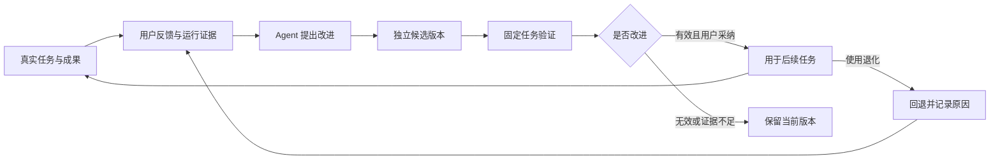

# 自进化：从真实任务持续改善 Agent

统一审阅与开发基线见[完整产品方案（修订 12）](brief.md)。本页保留专题细节及历史演变，不作为另一份待确认方案。

方案修订 8，2026-09-20。Focus Workspace 的两个核心目标是“自己使用方便的 Agent 助手”和“基于 DSH 持续自进化的 Agent”。本页定义第二个目标如何服务第一个目标，并约束 MVP 的底层设计。alpha.5 已实现模式配置候选的受控闭环，真实样例及后置自动化见[迭代 015](../iterations/015-mode-editor.md)，状态以[功能清单](features.md)为准。

## 自进化意味着什么

Agent 从实际任务、失败、用户纠正和可验证结果中发现问题，提出改进，生成可独立验证的能力或配置版本；验证有效后用于后续任务，并继续观察效果。随着使用积累，用户重复解释和手动纠正减少，任务成功率或效率提高，才算进化。仅保存更多会话、安装更多插件、升级模型或生成一段反思，不算进化完成。

两个目标相互约束：日常助手提供真实需求与反馈，自进化把改进带回下一次使用。不能为了改进系统而要求用户频繁维护复杂配置；也不能只优化聊天体验，让任务经验无法沉淀为可用能力。

这里首先进化的是 Agent 的工作方式与 Harness：偏好和上下文选择、Skill、指令、工具装配、Subagent 分工以及执行策略。训练基础模型参数不属于当前产品路线。未来允许生成新的工具和 DSH 插件，但作为可测试、可发布的独立版本处理；更改上游执行循环仍走正式工程发布。

## 一条完整链路

MVP 由用户从结果处点击“改进做法”，Agent 读取该任务及其明确授权范围内的证据，提出一个可解释的候选。用户决定是否验证与采用。发现问题、生成候选和归纳结果由 Agent 承担，采用由人把关；后续自动化仍使用同一套记录、验证和版本机制。

## 进化对象与阶段

| 对象 | 可以改变的内容 | 首次交付边界 |
| --- | --- | --- |
| 个人偏好与上下文 | 用户明确要求记住的偏好、项目指令、相关资料选择 | P1 先记录反馈及作用域，不从一次对话自动推断永久偏好；长期记忆与知识能力按后续阶段接入 |
| Skill 与指令 | 已选本地 Skill 的步骤、输出要求与检查项 | P1 最小闭环先选择一个 Skill，生成独立候选并验证；不覆盖用户源目录 |
| Harness 装配 | Tool、Skill、MCP 开关、已支持的参数和预设选择 | P1 沿用可校验、可追溯的版本机制；建议可人工编辑，不能仅靠自动开启更多能力获得高分 |
| Subagent 与执行策略 | 任务分工、上下文分配、模型选择与重试策略 | 接入已有管理能力后逐项扩展，先定义效果指标再开放调整 |
| 新工具、插件与核心实现 | 生成工具或 DSH 插件代码、替换已支持实现 | 后续在独立验证环境构建和测试；插件发布与上游内核修改区别管理，不直接写进正在使用的安装包 |

## MVP 必须建立的基础

MVP 仍只有“对话”和“Harness”两个入口。以下是第一期补齐项，不增加独立进化平台或后台常驻学习服务。

| 基础 | 最小要求 | 对日常使用的作用 |
| --- | --- | --- |
| 任务与实际版本关联 | 一个任务运行关联账号、工作区、会话/事件定位、实际模型及 Harness/Skill/上下文版本；缺失信息明确标未知 | 回答“这次为什么这样做”，后续能比较同类任务 |
| 结果反馈 | 用户可标记可用、需修改或失败，补充原因与修正；与客观工具错误分开保存 | 少重复解释，保留具体问题和期望 |
| 改进候选 | 记录来源任务、反馈、目标、基准版本、差异、影响范围及预期指标 | 用户能看懂改了什么、解决什么问题 |
| 最小验证 | 先保存任务输入、验收规则和当前版本结果；在独立目录用候选复跑，记录结果与限制 | 避免换了配置却不知道是否更好 |
| 采纳与回退 | 记录验证、选择原因及版本关系；应用只作用于后续任务，失败继续使用当前版本 | 不打断手头任务，改坏后能恢复 |

MVP 第一条进化链路建议限定为“根据一次用户纠正改进一个本地 Skill”，避免同时调整模型、指令和所有工具导致效果不可解释。详细字段在[工程设计](../engineering/evolution-foundation.md)统一维护；完整 Wiki、知识图谱和自动评测平台不是这条链路的前提。

## 实际使用示例

用户让 Agent 根据项目资料生成周报，发现结果漏了风险和下一步行动，补充“之后同类周报都需要这两项”。用户可以选择仅改当前成果，或将此作为当前项目的做法改进。

选择改进后，Agent 将该反馈与原任务绑定，生成周报 Skill 的候选版本，显示新增的风险与行动项检查步骤。用冻结输入的原任务验证，并用至少两个相邻任务检查是否影响原有格式和内容；在独立工作目录中运行，外部写操作不直接重放。用户比较成果后采用，新任务使用新版本；旧会话的原始版本关联保留。再次出现问题时，可回退并将原因加入候选记录。

这只是 P1 验收用例，不把“周报”固化为产品唯一场景。首个实际案例可替换为产品方案、资料整理等个人高频工作。

## 判断改进是否有效

方便使用的指标：真实任务完成率、得到可用成果的耗时、人工纠正次数，以及重复提供同一背景的次数。先记录实际基线，再设置目标，不编造现有成绩。

进化的指标：候选相对基准在目标任务上的改进、相邻任务回归情况、应用后的真实使用表现与回退原因。工具加载成功只通过装配检查，不代表行为变好；模型给出的自评分只能作为说明，不能代替成果检查或用户验收。

P1 建议每个候选至少覆盖一个目标任务和两个相邻回归任务，预先写明通过条件；结果波动时增加复跑或标记证据不足，三例通过也不宣称普遍提升。模型、输入、权限或依赖有变化时记录差异，不能直接把结果归功于候选。耗时、token、费用仅记录实际可取得的数据，缺失不填零。早期以人工辅助验证为主，P5 再完善评测集、批量运行和长期追踪。

## 应用与自动化程度

第一期默认“用户发起 → Agent 提出并生成候选 → 用户查看验证结果后采用”，同一次改进可拒绝、暂存或继续修改。评估不能覆盖基准样本、修改自己的通过标准，或将失败证据删掉。

后续自动采用可逐步开放给用户选定的对象和范围，并设置验证条件、运行预算及停止条件；任何自动化仍保留来源、差异、证据与回退记录。涉及新增凭证、扩大权限、外部发布或修改产品内核的动作使用独立授权与发布流程，不由一条“自进化”设置统包。

P1 不自动训练模型、不后台批量读取整个电脑、不静默扩大权限、不替换运行中任务的配置。基于任务中第三方内容生成的“建议”只是待验证材料，不能成为变更授权。

## 分期与验收

P1 建立上述基础，并通过一次“真实任务 → 明确反馈 → Agent 生成 Skill 候选 → 基准/候选比较 → 采纳 → 新任务验证 → 回退”的最小闭环；当前仅已验证其中的基础装配和版本回退能力。先让人工参与的一次改进成立，再增加候选类型与自动化程度。

P2～P4 的桌面、复杂管理和知识能力继续各自推进，可逐步产出更多进化对象，但不作为 P1 闭环的前置依赖。P5 承接批量评测、自动发现问题及受限自动采用，不再是自进化首次出现的阶段。新工具与插件代码进化单独定义执行隔离和发布验收后排期。

本次观测与自进化统一放入模式属性及子页面，具体交互见[模式编辑器](mode-editor.md)。自动 Skill 文件生成仍为完整目标，不与已实现的指令/装配候选混淆。
